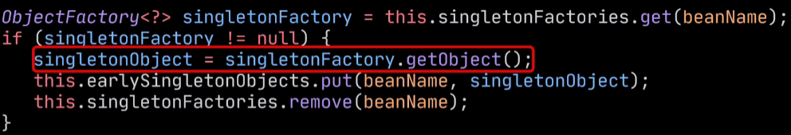
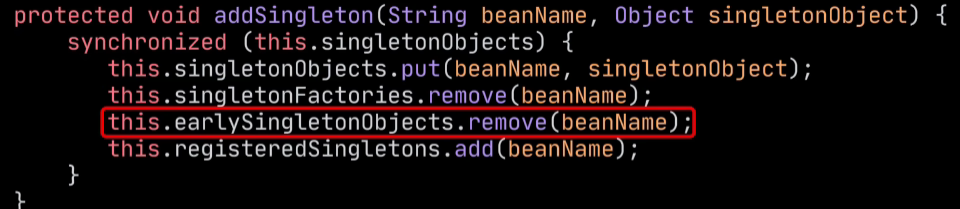

spring的三级缓存原理
场景：A对象中使用Autowire注入了对象B，B对象也同样注入了对象A

一级缓存：已经完成初始化的单例bean
二级缓存：保存对象属性还没填充好提前暴露在二级缓存的对象
三级缓存：存放ObjectFactory，取出后可以通过getObject方法来得到对象

假设先执行对象A的创建过程：
1.逐层查询三级缓存，发现没有，进入创建对象的流程
2.使用反射创建出对象A，这个时候创建出的对象会被包装成ObjectFactory放进三级缓存中
3.接着进入属性填充，A对象注入了B对象，逐层缓存查不到B，那么就进入B对象的创建流程

对象B的创建流程：
1.使用反射创建出B对象，同样包装厂成ObjectFactory放入三级缓存
2.进入属性填充，开始创建A对象，此时在三级缓存中能拿到A对象的ObjectFactory，通过getObject获取A对象，在源码中可以发现，获取完后会把属性没有填充完的对象A放入二级缓存，随后删除A在三级缓存中的ObjectFactory

3.接下来进入B的初始化
4.B对象已经完全创建完毕，接下来将B放入以及缓存，然后删除其在二三级缓存中的数据

接下来回到A的创建过程
4.创建完B对象后，A的属性填充完成
5.执行A的初始化
6.A对象已经创建完毕，接下来将A放入以及缓存，然后删除其在二三级缓存中的数据

这么一看好像不需要第三级缓存也能完成循环依赖的处理，我们可以将一开始创建的对象直接放入二级缓存中，但是三级缓存主要是为了实现AOP，如果B使用了AOP切面，那么A中引用的B也必须是B的代理对象，如果没有循环依赖，spring会先创建完普通对象再生成代理对象，但是spring并不能知道有没有循环依赖且直接给所有对象生成代理对象不现实，所以就有了ObjectFactory这一层包装，执行getObject后如果B实现了AOP，那么得到的就是B的代理对象